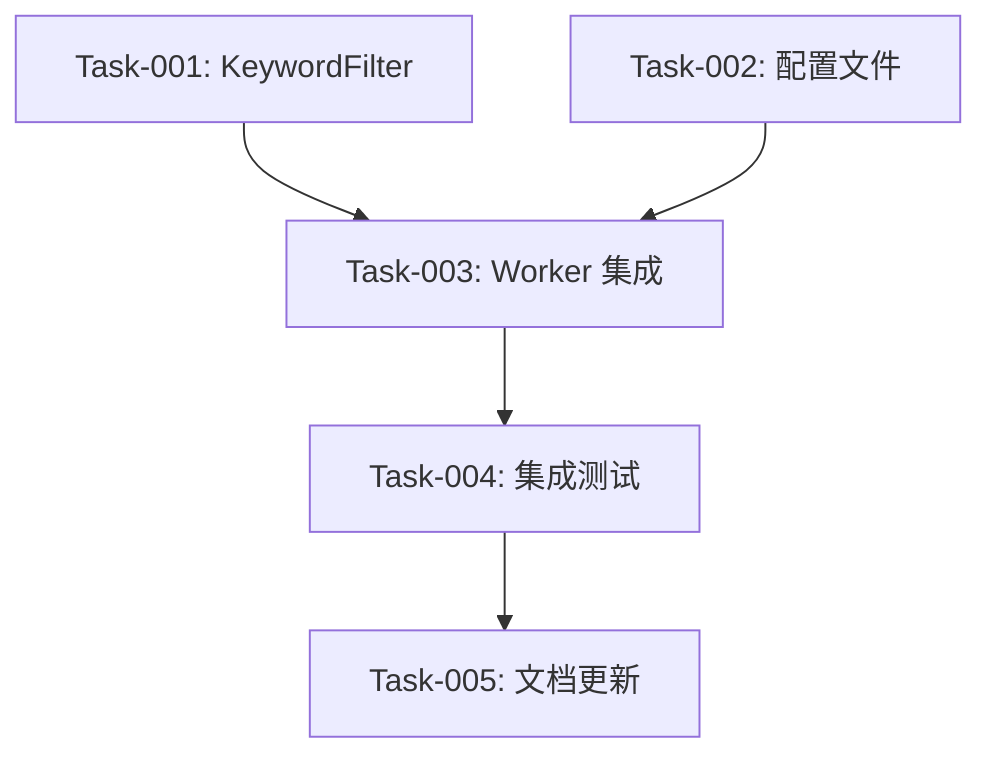

# 关键词过滤功能实现任务列表

**版本**: 5.0  
**创建日期**: 2026-05-19  
**更新日期**: 2026-05-19  
**总工时估算**: 8 小时

---

## 任务概览

| 阶段 | 任务数 | 估算工时 |
|------|--------|----------|
| 核心模块开发 | 1 | 3 小时 |
| Worker 集成 | 1 | 3 小时 |
| 测试与验证 | 2 | 2 小时 |
| **总计** | **4** | **8 小时** |

---

## 阶段 1: 核心模块开发 (3 小时)

### Task-001: 创建 KeywordFilter 类
**优先级**: P0  
**工时**: 3 小时  
**文件**: `src/lib/KeywordFilter.js`  
**验收标准**:
- [ ] 实现 `KeywordFilter` 类 (过滤核心)
- [ ] 实现 `RuleLoader` 类 (规则加载器)
- [ ] 实现 `filter(post)` 方法
- [ ] 实现 `loadRules(channel)` 方法 (带缓存)
- [ ] 支持关键词匹配和正则匹配
- [ ] 支持白名单/黑名单模式
- [ ] 支持渠道继承逻辑
- [ ] 正则预编译 (提升性能)
- [ ] **容错处理：JSON 格式错误时降级为"不过滤"模式**
- [ ] **容错处理：正则无效时跳过该规则并记录日志**
- [ ] **配置验证：检查字段类型和结构，使用默认值**
- [ ] 包含完整的 JSDoc 注释

**容错处理代码示例**:
```javascript
function safeLoadFilterRules() {
  try {
    const rawConfig = require('../filter-rules.json');
    return validateFilterConfig(rawConfig);
  } catch (error) {
    console.error('⚠️ Failed to load filter-rules.json:', error.message);
    console.error('📝 Falling back to no-filter mode');
    return {
      global: { mode: 'blacklist', rules: [] },
      channels: {}
    };
  }
}
```

**代码结构**:
```javascript
export class KeywordFilter {
  constructor(config)
  compileRules(rules)
  filter(post)
  evaluate(matchedRules)
}

export class RuleLoader {
  constructor(config)
  loadRules(channel)
  clearCache()
}
```

---

## 阶段 2: Worker 集成 (3 小时)

### Task-002: 创建配置文件
**优先级**: P0  
**工时**: 0.5 小时  
**文件**: `filter-rules.json`  
**验收标准**:
- [ ] 在项目根目录创建 `filter-rules.json`
- [ ] 包含 `global` 配置和空的 `channels` 对象
- [ ] 文件格式正确 (有效的 JSON)

**文件内容**:
```json
{
  "global": {
    "mode": "blacklist",
    "rules": []
  },
  "channels": {}
}
```

### Task-003: 修改 cache-worker.js - 集成过滤器
**优先级**: P0  
**工时**: 2.5 小时  
**文件**: `workers/cache-worker.js`  
**修改位置**: `processSingleChannel` 函数  
**验收标准**:
- [ ] 导入 `filter-rules.json` 配置文件
- [ ] 导入 `KeywordFilter` 和 `RuleLoader`
- [ ] 在 `parsePosts` 之后调用过滤器
- [ ] 过滤后的帖子才写入 D1
- [ ] 被过滤的帖子不触发推送
- [ ] 记录过滤统计日志
- [ ] `FILTER_ENABLED` 环境变量控制开关
- [ ] 全局 `RuleLoader` 只初始化一次 (避免重复解析)

**修改逻辑**:
```javascript
import filterRules from '../filter-rules.json';
import { KeywordFilter, RuleLoader } from '../src/lib/KeywordFilter.js';

// 全局规则加载器
const ruleLoader = new RuleLoader(filterRules);

async function processSingleChannel(task, env) {
  const { channel } = task;
  
  // ... 前序逻辑保持不变

  // ==========================================
  // 关键词过滤 (带开关控制)
  // ==========================================
  const filterEnabled = env.FILTER_ENABLED === 'true';
  let filteredPosts = posts;
  let blockedPosts = [];

  if (filterEnabled) {
    const ruleConfig = ruleLoader.loadRules(channel);
    const filter = new KeywordFilter(ruleConfig);

    filteredPosts = [];
    blockedPosts = [];

    for (const post of posts) {
      const filterResult = filter.filter(post);
      
      if (filterResult.passed) {
        filteredPosts.push(post);
      } else {
        blockedPosts.push({
          post,
          reason: filterResult.matchedRules.map(r => r.pattern).join(', '),
          mode: filterResult.mode
        });
      }
    }

    if (blockedPosts.length > 0) {
      console.log(`🚫 Blocked ${blockedPosts.length} posts for ${channel}`);
    }
  }
  // ==========================================

  // 使用 filteredPosts 继续后续处理
}
```

---

## 阶段 3: 测试与验证 (2 小时)

### Task-004: 集成测试
**优先级**: P0  
**工时**: 1.5 小时  
**验收标准**:
- [ ] 创建测试配置文件 (含黑名单规则)
- [ ] 配置 `FILTER_ENABLED=true`
- [ ] 部署 Worker
- [ ] 手动触发采集，验证过滤效果
- [ ] 验证被过滤的帖子不存入 D1
- [ ] 验证被过滤的帖子不触发推送
- [ ] 验证正则表达式规则生效
- [ ] 验证渠道继承规则生效
- [ ] 验证 `FILTER_ENABLED=false` 时跳过过滤

**测试步骤**:
```bash
# 1. 修改配置文件 (添加测试规则)
cat > filter-rules.json << 'EOF'
{
  "global": {
    "mode": "blacklist",
    "rules": [
      {
        "id": "1",
        "pattern": "测试过滤",
        "ruleType": "keyword",
        "isActive": true,
        "description": "测试规则",
        "createdAt": "2026-05-19T00:00:00.000Z"
      }
    ]
  },
  "channels": {}
}
EOF

# 2. 配置环境变量
wrangler secret put FILTER_ENABLED
# 输入：true

# 3. 部署 Worker
wrangler deploy

# 4. 查看日志
wrangler tail

# 5. 检查 D1 数据
wrangler d1 execute multi-channel-db --command="SELECT * FROM posts LIMIT 10;"
```

### Task-005: 文档更新
**优先级**: P2  
**工时**: 0.5 小时  
**文件**: `README.md`, `.env.example`  
**验收标准**:
- [ ] `README.md` 添加过滤功能说明
- [ ] `README.md` 添加配置示例
- [ ] `.env.example` 添加 `FILTER_ENABLED` 配置
- [ ] 添加更新规则的操作说明

**`.env.example` 新增内容**:
```bash
# =====================================
# 关键词过滤功能 (可选)
# =====================================

## 启用关键词过滤 (true/false)
## 默认：false (不启用)
# FILTER_ENABLED=false
```

---

## 任务依赖关系



---

## 完成定义 (DoD)

所有任务完成后，需要满足以下条件：

- [ ] 所有 P0 优先级任务完成
- [ ] 集成测试验证通过
- [ ] 过滤功能在生产环境部署
- [ ] 性能指标达标
- [ ] 文档更新完成

---

## 附录

### 相关文件
- [需求文档](./requirements.md)
- [技术设计文档](./design.md)

### 关键文件路径
```
project-root/
├── filter-rules.json                    # 过滤规则配置 (新增)
├── src/lib/
│   └── KeywordFilter.js                 # 核心过滤类 + 规则加载器 (新增)
├── workers/
│   └── cache-worker.js                  # Worker 主文件 (修改)
└── wrangler.toml                        # Worker 配置
```
