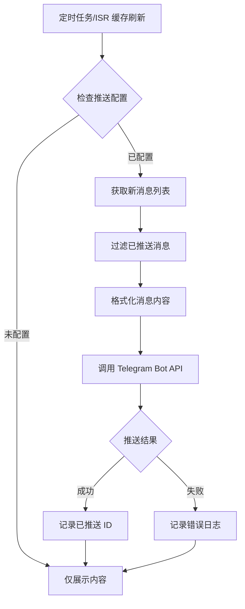

# Telegram 推送功能技术设计

Feature Name: telegram-push-notification
Updated: 2026-05-06

## 描述

为 Multi-Channel Broadcast 项目添加向 Telegram 频道推送最新消息的能力。该功能在网站定时获取并缓存新内容时,自动将新内容推送到管理员配置的 Telegram 频道,实现内容分发的自动化。

推送功能采用可选设计,通过环境变量控制开关,不影响现有的内容聚合和展示流程。

## 架构



### 架构说明

1. **集成点**: 推送逻辑集成在现有的内容获取流程中,在 `src/lib/telegram/` 模块获取新消息后触发
2. **异步执行**: 推送操作异步执行,不阻塞内容展示
3. **去重机制**: 使用内存 LRU Cache 记录已推送的消息 ID
4. **配置驱动**: 通过环境变量控制功能开关

## 组件和接口

### 1. 推送配置模块 (`src/lib/telegram/push-config.js`)

**职责**: 读取和验证推送相关的环境变量配置

**接口**:
```javascript
export function getPushConfig() {
  return {
    enabled: boolean,
    botToken: string | undefined,
    channelId: string | undefined,
    isValid: boolean
  }
}
```

**实现要点**:
- 从 `process.env` 读取 `TELEGRAM_BOT_TOKEN`、`TELEGRAM_PUSH_CHANNEL_ID`、`TELEGRAM_PUSH_ENABLED`
- 验证配置完整性
- 返回配置对象供推送模块使用

### 2. 推送去重模块 (`src/lib/telegram/push-dedup.js`)

**职责**: 管理已推送消息的记录,避免重复推送

**接口**:
```javascript
import { LRUCache } from 'lru-cache'

const pushedMessages = new LRUCache({ max: 1000 })

export function hasPushed(messageId: string): boolean
export function markAsPushed(messageId: string): void
```

**实现要点**:
- 使用项目已有的 `lru-cache` 依赖
- 消息 ID 格式: `{channelName}:{messageId}`
- 最大缓存 1000 条记录
- 服务重启后缓存清空(可接受)

### 3. 消息格式化模块 (`src/lib/telegram/push-formatter.js`)

**职责**: 将消息内容格式化为 Telegram HTML 格式

**接口**:
```javascript
export function formatPushMessage(message: MessageObject): {
  text: string,
  parse_mode: 'HTML',
  link_preview_options?: object
}
```

**实现要点**:
- 生成 HTML 格式消息,包含:
  - 标题(加粗)
  - 摘要(前 200 字符)
  - 来源频道(链接)
  - 发布时间
  - 原文链接
- 处理特殊字符转义(`<`, `>`, `&`)
- 截断超长内容(不超过 4096 字符)
- 提取第一张图片 URL(如果有)

**消息模板**:
```html
<b>{title}</b>

{summary}

<i>来源: <a href="{channelUrl}">{channelName}</a></i>
<i>发布时间: {publishTime}</i>

<a href="{postUrl}">查看原文</a>
```

### 4. Telegram API 调用模块 (`src/lib/telegram/push-api.js`)

**职责**: 调用 Telegram Bot API 发送消息

**接口**:
```javascript
export async function sendTelegramMessage(
  botToken: string,
  channelId: string,
  message: { text: string, parse_mode: string }
): Promise<{ success: boolean, error?: string }>
```

**实现要点**:
- 使用 `ofetch` 库调用 `https://api.telegram.org/bot{token}/sendMessage`
- 支持 HTML 格式
- 处理网络错误和 API 错误
- 超时设置: 10 秒
- 不重试(避免阻塞)

### 5. 推送服务模块 (`src/lib/telegram/push-service.js`)

**职责**: 编排推送流程,协调各模块

**接口**:
```javascript
export async function pushMessage(message: MessageObject): Promise<void>
```

**流程**:
1. 检查推送配置是否有效
2. 检查消息是否已推送(去重)
3. 格式化消息内容
4. 调用 Telegram API 发送
5. 标记为已推送
6. 记录日志

### 6. 集成点修改 (`src/lib/telegram/index.js` 或相关入口)

**修改位置**: 在获取新消息后,调用推送服务

**实现**:
```javascript
// 在获取消息的循环中
for (const message of newMessages) {
  // 现有逻辑: 缓存和展示
  cacheMessage(message)
  
  // 新增: 异步推送(不阻塞)
  pushMessage(message).catch(err => {
    console.error('[Push] Failed:', err)
  })
}
```

## 数据模型

### 推送配置对象

```typescript
interface PushConfig {
  enabled: boolean          // 是否启用推送
  botToken: string          // Bot Token
  channelId: string         // 目标频道 ID
  isValid: boolean          // 配置是否有效
}
```

### 消息对象(扩展现有结构)

```typescript
interface MessageObject {
  id: string                // 消息唯一 ID
  channelName: string       // 来源频道名
  title: string             // 消息标题
  content: string           // 消息内容(HTML)
  summary: string           // 消息摘要
  publishTime: string       // 发布时间
  url: string               // 消息链接
  imageUrl?: string         // 第一张图片 URL(可选)
}
```

## 正确性属性

### 不变量

1. **推送不影响主流程**: 推送失败不得影响内容展示和缓存
2. **不重复推送**: 同一消息(ID 相同)不得被推送多次
3. **配置安全**: Bot Token 不得在日志中明文输出
4. **消息长度**: 推送消息不得超过 Telegram 4096 字符限制

### 约束条件

1. 推送操作必须在 10 秒内完成或超时
2. 去重缓存最多保留 1000 条记录
3. 推送仅在 ISR 缓存刷新或定时任务触发时执行
4. 环境变量变化后,下次推送立即生效

## 错误处理

### 错误场景和策略

| 场景 | 处理方式 | 日志级别 |
|------|---------|---------|
| 配置未设置 | 跳过推送,不记录日志 | - |
| 配置无效 | 跳过推送,记录错误 | ERROR |
| 网络超时 | 跳过推送,记录警告 | WARN |
| API 返回 401/403 | 跳过推送,记录错误(凭据无效) | ERROR |
| API 返回 429 | 跳过推送,记录警告(速率限制) | WARN |
| 消息格式化失败 | 跳过推送,记录错误 | ERROR |
| 未知异常 | 捕获异常,记录错误堆栈 | ERROR |

### 日志格式

```
[Push] Success: {channelName}:{messageId}
[Push] Skipped (already pushed): {channelName}:{messageId}
[Push] Failed: {channelName}:{messageId} - {error message}
[Push] Disabled: push not configured
```

## 测试策略

### 单元测试

1. **配置模块测试**
   - 测试环境变量读取
   - 测试配置验证逻辑
   - 测试缺失配置的处理

2. **格式化模块测试**
   - 测试正常消息格式化
   - 测试超长内容截断
   - 测试特殊字符转义
   - 测试无标题/无图片场景

3. **去重模块测试**
   - 测试首次推送(未记录)
   - 测试重复推送(已记录)
   - 测试 LRU 淘汰逻辑

4. **API 模块测试**
   - Mock Telegram API 成功响应
   - Mock 网络超时
   - Mock API 错误(401, 403, 429)

### 集成测试

1. 测试完整推送流程(配置检查 → 去重 → 格式化 → API 调用)
2. 测试推送失败不影响内容展示
3. 测试环境变量热更新

### 测试工具

- 使用 `vitest` 或项目现有测试框架
- Mock `ofetch` 调用
- Mock 环境变量

## 实现计划

### 阶段 1: 核心模块开发

1. 创建 `src/lib/telegram/push-config.js`
2. 创建 `src/lib/telegram/push-dedup.js`
3. 创建 `src/lib/telegram/push-formatter.js`
4. 创建 `src/lib/telegram/push-api.js`
5. 创建 `src/lib/telegram/push-service.js`

### 阶段 2: 集成和测试

1. 修改现有内容获取流程,集成推送服务
2. 编写单元测试
3. 本地测试推送功能

### 阶段 3: 文档和部署

1. 更新 `.env.example` 添加推送配置示例
2. 更新 `README.md` 添加推送功能说明
3. 更新 `README.zh-cn.md` 添加中文说明

## 参考

[^1]: Telegram Bot API - https://core.telegram.org/bots/api#sendmessage
[^2]: LRUCache 文档 - https://github.com/isaacs/node-lru-cache
[^3]: 项目现有 Telegram 模块 - `src/lib/telegram/`
